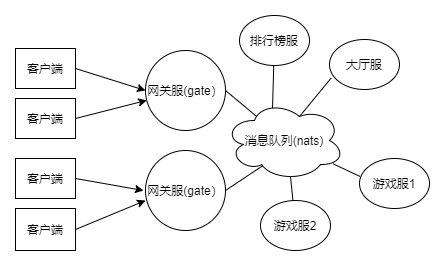

# goserver
基于消息队列（nats)的游戏服务器框架

# 架构
 
分布式服务器以nats为消息交换中心，客户端发送的消息统一由gate服进行路由转发

## 1,gate服
和客户端通信使用websocket，仅支持protobuf，数据结构： 

    -------------------------
    | id | protobuf message |
    -------------------------
id是消息名的Hash值，用于标记消息名，反解析数据 
因为websocket协议已经支持iframe分帧处理，不需要处理粘包，故包结构中无需包长度字段 

## 2，多服rpc通信
使用nats(消息队列)构建服务器间通信，支持send,request,call请求

## 配置
gate服: server.NewGate(serverId,listenAddr,goserver.Config{Nats: natsAddr})  
其它服: server.NewServer(serverId,goserver.Config{Nats: natsAddr}) 

其中，每个服务器有个唯一serverId即可,natsAddr就是nats的地址,gate服多一个listenAddr代表监听端口 
# 示例
1，启动消息队列服务（https://github.com/nats-io/nats-streaming-server)  
2，见example目录，依次启动user/main.go,gate/main.go,client/main.go 
先启动user服，再启动gate服，gate向user服发送rpc消息，通知型:pb.ReqSend{},请求回应型:pb.ReqRequest{} 
最后启动client,会模拟发送客户端消息pb.ReqHello,此消息会被gate转发到user服，模拟路由消息情况

# 基于goserver的游戏服务器
avatar-fight-server https://github.com/0990/avatar-fight-server

